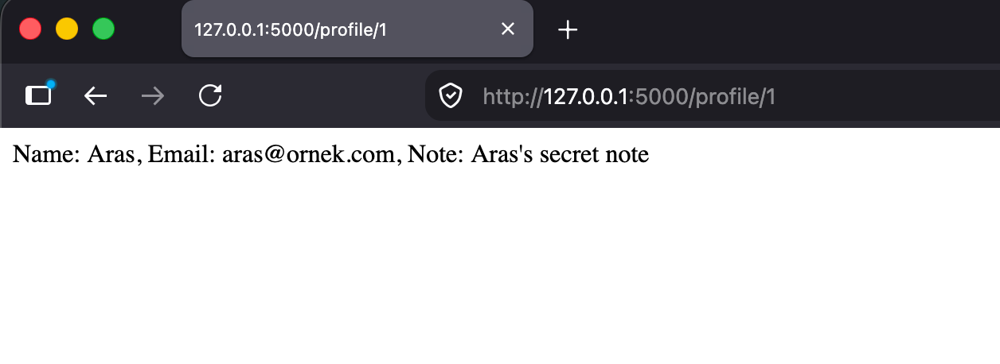
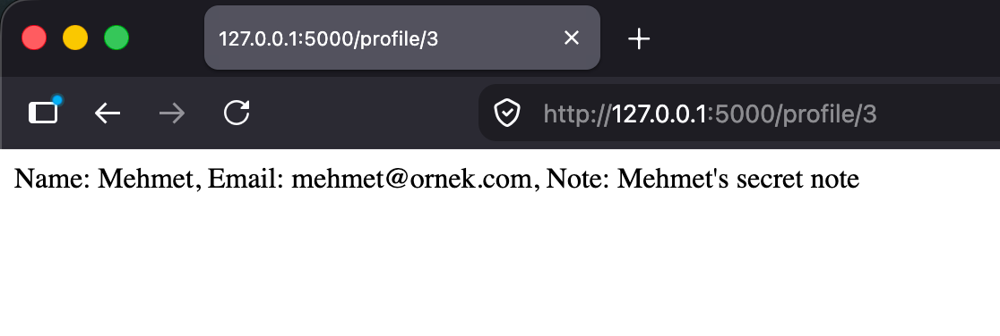
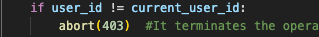

# Flask IDOR Demo
A project demonstrating how an IDOR (Insecure Direct Object Reference) vulnerability occurs and how it is fixed in a simple Flask application.

## Vulnerability
The `/profile/<user_id>` route returned user data based on the ID in the URL without performing any authorization checks. In this situation, a logged-in user could access the information of users other than their own by entering `/profile/2` or `/profile/3` instead of `/profile/1`.

## Evidence

## Fix
An `if` block was added to the `profile()` function to check whether the requested `user_id` matches the logged-in user's ID (`current_user_id`). If they do not match, access is denied using `abort(403)`.

## Why this vulnerability is important?
IDOR is a very common vulnerability in the real world.It typically arises not from writing "malicious" code, but from overlooking authorization checks. This project demonstrates how even a simple route definition can give rise to this vulnerability.